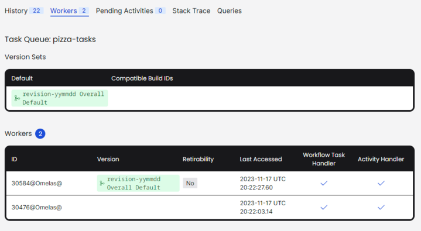

# Exercise 2: Version the Change with Worker Versioning

During this exercise, you will

* Define Worker Build ID Version Sets and enable Versioning on your Worker
* Make a change to your Workflow, and redeploy an updated Worker
* Ensure that your Workflows have switched to using the new code path
* Decommission an old Worker

If you are running this exercise locally with a Temporal Cluster that 
you started via the `temporal server start-dev` command, you must
restart it using some additional parameters that will enable the 
Worker Versioning feature:

```shell
temporal server start-dev \
   --dynamic-config-value frontend.workerVersioningDataAPIs=true \
   --dynamic-config-value frontend.workerVersioningWorkflowAPIs=true \
   --dynamic-config-value worker.buildIdScavengerEnabled=true
```

The above step is not necessary if you are using GitPod to run this 
exercise.

Make your changes to the code in the `practice` subdirectory (look for 
`TODO` comments that will guide you to where you should make changes to 
the code). If you need a hint or want to verify your changes, look at 
the complete version in the `solution` subdirectory.


## Part A: Assign a Build ID to Your Worker and Task Queue

1. Before enabling Worker Versioning, try running this Workflow
   without making any further modifications. Unlike our other exercises,
   the `practice` subdirectory contains fully working example code.
   Run `go run worker/main.go` in one terminal to launch your Worker,
   and `go run start/main.go` in another terminal to successfully run
   your Workflow. This way, you can see what it's like to start using
   Worker Versioning in an environment that's already running an
   unversioned Worker.
2. Edit the `worker/main.go` file to add a Build ID to your Worker
   and opt in to Worker Versioning. To do this, replace the empty
   `worker.Options{}` struct that's currently provided as an argument
   to `worker.New()` with a struct containing a `BuildID` and the
   `UseBuildIDForVersioning: true` parameter.
3. Edit the `start/main.go` file to call
   `client.UpdateWorkerBuildIdCompatibility()` before starting your
   Workflow.
4. Run a new version of your worker by running `go run worker/main.go` 
   in a new terminal window. You do not need to terminate your old
   worker. If you restart your workflow by running `go run start/main.go`
   again, you should see some output from the terminal window of your
   new worker. This indicates that the workflow was chosen and run by
   the new, versioned worker, and the unversioned worker was ignored.
5. To retrieve the information about build IDs from the CLI, run
   `temporal task-queue get-build-ids --task-queue pizza-tasks`. You
   should see output similar to this:
   ```output
         BuildIds        DefaultForSet   IsDefaultSet
     [revision-yymmdd]  revision-yymmdd  true
   ```


## Part B: Decommission Your Old Worker

1. Now that you have a new, versioned Worker running, you probably
   aren't planning on submitting any more Workflows to your old,
   unversioned Worker. However, it's important to make sure that your
   old Worker isn't still handling any Workflows -- and that it has
   a ready replacement -- before decommissioning it. There are a
   few ways of verifying this, using the CLI and the Web UI. The
   "Retirability" field you saw in the last step is one.
2. Run `temporal task-queue describe --task-queue pizza-tasks`. Both
   of your running Workers should report in, as they are continuing to
   poll despite not receiving any more Workflow Execution requests:
   ```output
       Identity     LastAccessTime  RatePerSecond
     30404@Omelas@  39 seconds ago         100000
     8692@Omelas@   40 seconds ago         100000
   ```
3. Run `temporal task-queue get-build-id-reachability -t pizza-tasks --build-id revision-yymmdd`.
   This will return information about which whether your new Build ID is
   available and accepting both New and Existing Workflows:
   ```output
         BuildId       TaskQueue            Reachability
     revision-yymmdd  pizza-tasks  [NewWorkflows
                                   ExistingWorkflows]
   ```
   You can also verify this by visiting the Web UI again. Examine
   the `pizza-tasks` Task Queue or the "Workers" UI tab to
   see the registered Workers and their versions. You should notice
   a "Retirability" field indicating which of your Workers that you
   are able to safely retire, as they are no longer registered as a
   default or handling any existing Workflows:
   
   


## Part C: Add Another Worker Using Version Sets

1. Lastly, you'll experiment with Version Sets using the CLI rather
   than the SDK. In Part A, you used
   `client.UpdateWorkerBuildIdCompatibility()` to update your Task
   Queue with new a Worker Version. You can accomplish the same
   thing by running `temporal task-queue update-build-ids` with
   matching parameters.
2. Assume you are adding another new Worker Version that is compatible with the
   Version that you added in Part A. To do this, try running:

   ```shell
   temporal task-queue update-build-ids add-new-compatible \
      --build-id="revision-yymmdd+1" \
      --existing-compatible-build-id="revision-yymmdd" \
      --task-queue="pizza-tasks"
   ```

   This will add `revision-yymmdd+1` as another compatible Build ID to the same
	Task Queue. This is equivalent to running the following SDK code:

   ```go
   client.UpdateWorkerBuildIdCompatibility(context.Background(), &client.UpdateWorkerBuildIdCompatibilityOptions{
		TaskQueue: pizza.TaskQueueName,
		Operation: &client.BuildIDOpAddNewCompatibleVersion{
			BuildID:                   "revision-yymmdd+1",
			ExistingCompatibleBuildId: "revision-yymmdd",
		},
	})
   ```

   (`pizza.TaskQueueName` refers to a constant defined in `shared.go`.)

   In practice, you should find this at least as useful as updating your
   Task Queues from the SDK.
3. Lastly, you can now deploy a new Worker, identified by this new Build ID,
   and it will be able to process the same Workflows. Although you would
   ordinarily do this when making code changes, you can do it without changing
   anything for the sake of this example. Update the `BuildID` field from your
   `worker.Options{}` declaration to reflect the new `revision-yymmdd+1`
   Version and restart your Worker once again, then re-run your Workflow
   starter. You should observe that both Worker Build IDs are compatible and
   able to process the Workflow.


### This is the end of the exercise.

